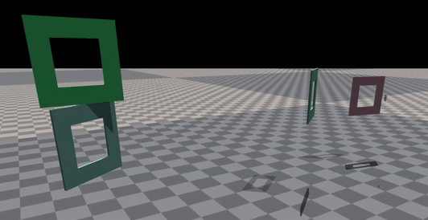

# Aerial Gym Race
This is a fork of the [Aerial Gym Simulator](https://www.github.com/ntnu-arl/aerial_gym_simulator) repository with implementations for training a drone-racing policy, featuring:
* A racing drone robot model with a ~10:1 thrust-to-weight ratio.
* Gate asset
* Racing environment with randomly generated gates.
* Racing task with gate-passing detection.



## Installation
Refer to the installation section of the [getting started](https://ntnu-arl.github.io/aerial_gym_simulator/2_getting_started/#installation) page of Aerial Gym Simulator, but clone this repository instead.

## Training a policy
```BASH
cd ~/workspaces/aerial_gym_ws/src/aerial_gym_race/aerial_gym/rl_training/rl_games
python3 runner.py --task=race_task_sim2real_end_to_end 
```

## Playing a trained policy
In the command below replace `PATH_TO_WEIGHTS` with the path to the weights of the trained policy, for example: `./runs/gen_ppo_xx-xx-xx-xx/nn/gen_ppo.pth`.
```BASH
python3 runner.py --task=race_task_sim2real_end_to_end --play --checkpoint=PATH_TO_WEIGHTS --num_envs=1
```

## Generating an FPV video of a trained policy
FPV Videos like the one shown below can be recorded automatically using the `race_task_camera` task. The generated video is has a resoltion of 1280x960 at 100fps and is saved to a folder called `camera_output`.
To run this task execute, `PATH_TO_WEIGHTS` should be replaced by the path to the weights of the trained policy:
```BASH
python3 runner.py --task=race_task_camera --play --checkpoint=PATH_TO_WEIGHTS --num_envs=1
```

