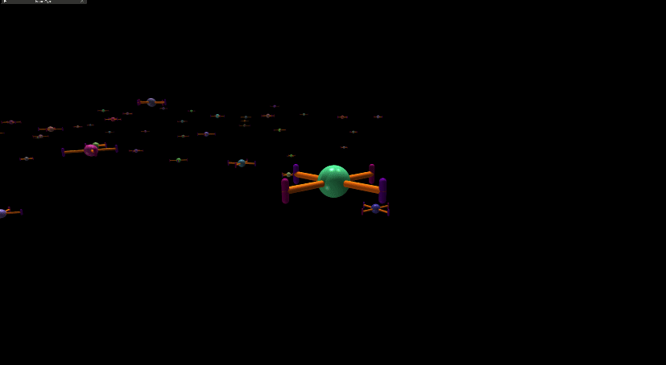
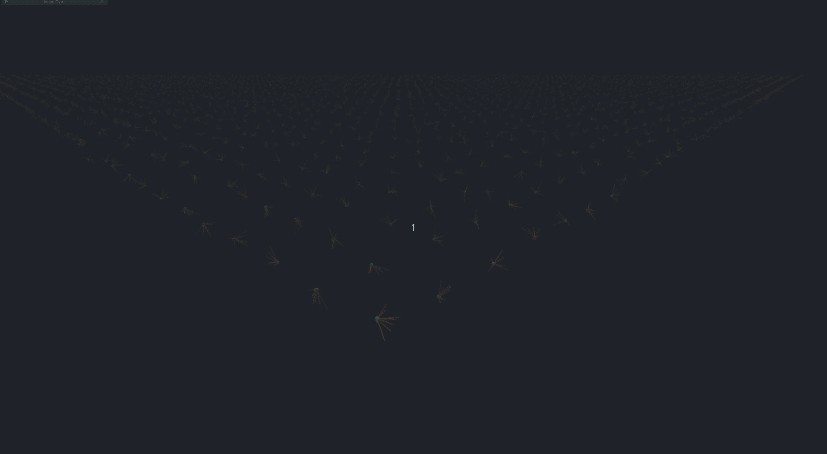

## Robots

### Underactuated Quadrotor

We provide a classic planar quadrotor design as the default choice for the robot platform in our simulation. The robot model is deliberately kept simplistic (in terms of structure, texture etc) to allow for faster simulation speeds. The robot mass and inertia parameters can be set by modifying the URDF of the robot. Moreover, the controller parameters can be tuned to match the response of your real-world platform.





### Fully-acutated Octarotor

We also provide a fully actuated octarotor platform based on the work in [Design, Modeling and Control of an Omni-Directional Aerial Vehicle](https://idsc.ethz.ch/content/dam/ethz/special-interest/mavt/dynamic-systems-n-control/idsc-dam/People/bdario/brescianini_dandrea_omnidirectional_aerial_vehicle.pdf) by Dario Brescianini and Raffaello D’Andrea. The default controller for this platform allows for direct motor control via thrust commands to each motor.


### Arbitrary Configuration

To show how to operate with arbitrary platform designs, we also provide a URDF of a multirotor platform with an unconventional configuration. This design is arrived at via optimization through evolutionary algorithms that provide a high-fitness value to robot configurations for which controllers can be learnt for setpoint tracking tasks. We also provide a learned controller for the particular platform.



The above GIF shows the arbitrary platform trained using a motor-control policy to reach a goal position. 

!!! warning "Using provided geometric controllers for this configuration"
    will perform suboptimally as they assume that the center of mass for this configuration is at the root link of the robot. To account for the torque exerted about the root link beacuse of an offset center-of-mass, additional terms will be required to be added to the controller. Users are encouraged to provide these themselves for their arbitrary configurations. The controllers will work but will not exploit the controllability of the platform along other dimensions of motion. It is currently an area of active research and users are encouraged to explore learning-based solutions as well.


!!! warning "Allocation matrix for this configuration"
    is derived assuming unconstrained motor command allocation and then clamping the actions. This is a general problem when dealing with arbitrary configurations and is an area of active research. Users are encouraged to explore learning-based solutions for such platforms. The allocation matrix for the provided configuration is calculated w.r.t the root link of the robot.


## Controllers

### Parallelized Geometric Controllers


We adapt and package controllers for underactuated planar platforms such as quadrotor, hexarotor, and octarotor. The controllers are based on the work in [Control of Complex Maneuvers for a Quadrotor UAV using Geometric Methods on SE(3)](https://arxiv.org/abs/1003.2005) by Taeyoung Lee, Melvin Leok, and N. Harris McClamroch.  We adapt the controllers to proide efficient parallelization on the GPU for the simultaneous control of (hundreds of) thousands of multirotor vehicles. The controllers are implemented in PyTorch and pre-compiled using the PyTorch JIT compiler for added speedup. The controllers are designed to be modular and can be easily extended to other platforms. We provide examples of use of this controller with a fully actuated octarotor platform and a planar quadrotor platform.

??? warning "Use of parallelized geometric controllers with fully actuated platforms"
    is bound to produce sub-optimal results as the controllers are designed for quadrotor-like platforms that have all the axes of the motors parallel to each other. The controllers will work on fully actuated platforms but will not exploit the controllability of the platform along other dimensions of motion. It is currently an area of active research and users are encouraged to explore learning-based solutions as well.


#### Attitude-Thrust and Body-rate-Thrust Controllers

The errors in desired orientation $e_R$ and body rates $e_{\Omega}$ are computed as:

$$ e_R = \frac{1}{2}  (R_d^T  R - R^T  R_d)^{\vee}, $$

and

$$ e_{\Omega} = \Omega - R^T  R_d  \Omega_d .$$

The desired body-moment $M$ is computed as:

$$ M = -k_R e_R - k_{\Omega} e_{\Omega} + \Omega \times J \Omega, $$

where we set the desired angular velocity $\Omega_d = 0$ in case of attitude control and $R_d = R$ in case of body-rate control. The thrust command is directly provided as a control input to the controller.


#### Position, Velocity and Acceleration Controllers


Given the above attitude controllers, we first calculate the desired body force $f$ and the desired orientation $R_d$ using the following equations:

$$ f = -k_x e_x - k_v e_v - m g e_3 + m \ddot{x}_d, $$

and

$$ M = -k_R e_R - k_{\Omega} e_{\Omega} + \Omega \times J \Omega_c, $$

where $e_R = \frac{1}{2} (R_c^T R - R^T R_c)^{\vee}$, and $e_{\Omega_c} = \Omega - R^T R_c \Omega_c$. To calculate the matrix $R_c$, we use:

$$ R_c = [ b_{1_c}; b_{3_c}\times b_{1_c}; b_{3_c} ], $$

where, $b_{3_c} = - \frac{-k_x e_x - k_v e_v - m g e_3 + m \ddot{x}_d}{ || -k_x e_x - k_v e_v - m g e_3 + m \ddot{x}_d || }$, and $b_{1_c}$ is a vector orthogonal to $b_{3_c}$.


For the case of velocity control, we set the position error $e_x = 0$ and the desired acceleration $\ddot{x}_d = 0$, for the case of acceleration control, we set the position error and the desired velocity $\dot{x}_d = 0$.

Similarly, for the velocity-steering angle-controller, we combine the above concepts to allow a yaw-setpoint to be provided along with the velocity setpoint.


## Motor Command Allocation and Thrust Mapping

We provide support to allocate motor forces using the control allocation matrix. The allocation matrix is obtained from the geometry of the robot and needs to be explicitly defined in the configuration file. The allocation matrix allows for assigning motor forces given wrench (force and torque) commands for the base link.

??? info "The allocation matrix for each robot can be defined in the robot configuration file."
    Below is the example from the fully-actuated octarotor configuration file:
    ```python
    allocation_matrix = [
        [-0.78867513, 0.21132487, -0.21132487, 0.78867513, 0.78867513, -0.21132487, 0.21132487, -0.78867513,],
        [0.21132487, 0.78867513, -0.78867513, -0.21132487, -0.21132487, -0.78867513, 0.78867513, 0.21132487,],
        [0.57735027, -0.57735027, -0.57735027, 0.57735027, 0.57735027, -0.57735027, -0.57735027, 0.57735027,],
        [-0.01547005, -0.25773503, 0.21547005, -0.14226497, 0.14226497, -0.21547005, 0.25773503, 0.01547005,],
        [-0.21547005, -0.14226497, -0.01547005, 0.25773503, -0.25773503, 0.01547005, 0.14226497, 0.21547005,],
        [0.23094011, -0.11547005, -0.23094011, 0.11547005, -0.11547005, 0.23094011, 0.11547005, -0.23094011,],
    ]
    ```

You can read more about how this is used [in this blog post](https://www.cantorsparadise.com/how-control-allocation-for-multirotor-systems-works-f87aff1794a2).

Given an allocation matrix and the motor commands, we can calculate the wrench (force and torque) commands for the base link as 

$$ \begin{bmatrix} f_x \\ f_y \\ f_z \\ M_x \\ M_y \\ M_z \end{bmatrix} = A_{6 \times n}  \begin{bmatrix} u_1 \\ u_2 \\ u_3 \\ ... \\ u_n \end{bmatrix}, $$

where $f$ is the force, and $M$ is the moment for the base link, $A$ is the allocation matrix, and $u_i$ represents the motor force for the motor $i$. We use the pseudo-inverse of the allocation matrix to obtain motor commands:

$$ \begin{bmatrix} u_1 \\ u_2 \\ u_3 \\ ... \\ u_n \end{bmatrix} = A^+  \begin{bmatrix} f_x \\ f_y \\ f_z \\ M_x \\ M_y \\ M_z \end{bmatrix}_{desired}, $$

where $A^+$ is the pseudo-inverse of the allocation matrix.

!!! warning "While this works in the case of platforms such as the quadrotor or fully-actuated octarotor, it may or may not work for arbitrary configurations or it may not produce the energetically optimal allocation for efficient flight. Users are encouraged to explore learning-based solutions for such platforms."


## Motor Model

We model the simulated motors as a first-order system with randomizable time-constants. The thrust commands can be clamped to minimum and maximum values and are updated at each time-step based on the reference thrust values from the controller, following the equation:

$$ \dot{f_i} = \frac{1}{\tau_i} (f_{ref_i} - f_i), $$

where $f_i$ is the current thrust value for motor $i$, $f_{ref_i}$ is the reference thrust value from the controller, and $\tau_i$ is the time-constant of the motor. The thrust rate is clamped to a maximum value to prevent the motors from saturating. The users are encouraged to match the model to their robot platform for accurate simulation results.

!!! example "First order motor model"
    ```python
    def update_motor_thrusts(self, ref_thrust):
        ref_thrust = torch.clamp(ref_thrust, self.min_thrust, self.max_thrust)
        self.motor_thrust_rate[:] = (1.0 / self.motor_time_constants) * (ref_thrust - self.current_motor_thrust)
        self.motor_thrust_rate[:] = torch.clamp(self.motor_thrust_rate, -self.cfg.max_thrust_rate, self.cfg.max_thrust_rate)
        self.current_motor_thrust[:] = (self.current_motor_thrust + self.dt * self.motor_thrust_rate)
        return self.current_motor_thrust

    ```


## Drag Model

A simplistic model for drag is implemented that that can be customized to the user's needs. Linear and quadratic drag coefficients for drag induced by velocity and angular velocity can be set in the configuration file. The drag force $F_{drag}$ and torque $M_{drag}$ in the body-frame are calculated as:

$$ F_{drag} = -k_{v_{linear}} v -k_{v_{quadratic}} v |v|, $$

and 

$$ M_{drag} = -k_{\omega_{linear}} \omega -k_{\omega_{quadratic}} \omega |\omega|, $$

where $v$ is the linear velocity, $\omega$ is the angular velocity expressed in the body frame, and $k$ are the drag coefficients. The drag model can be customized to the user's needs by changing the robot-specific parameters in the configuration file.