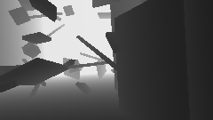
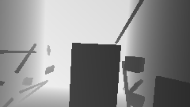
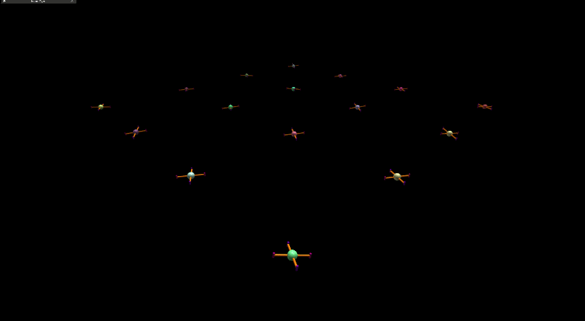

# Reinforcement Learning


## Reinforcement Learning for Navigation Tasks using Depth Images

We provide a ready-to-use policy that was used for the work in [Reinforcement Learning for Collision-free Flight Exploiting Deep Collision Encoding](https://arxiv.org/abs/2402.03947). The observation space is redefined to match the example shown in the paper and a script is provided to run the inference on the trained policy. To check out the performance of the policy yourself, please follow the steps below:

```bash
cd examples/dce_rl_navigation
bash run_trained_navigation_policy.sh
```

You should now be able to see the trained policy in action:


For this task, the rendering is done using Warp by default and the robot's depth camera sees the environment as shown below:

  

If you use this work, please cite the following paper:

```bibtex
@misc{kulkarni2024reinforcementlearningcollisionfreeflight,
      title={Reinforcement Learning for Collision-free Flight Exploiting Deep Collision Encoding}, 
      author={Mihir Kulkarni and Kostas Alexis},
      year={2024},
      eprint={2402.03947},
      archivePrefix={arXiv},
      primaryClass={cs.RO},
      url={https://arxiv.org/abs/2402.03947}, 
}
```


## Train policies for your own robot with the Aerial Gym Simulator

We provide examples with [rl-games](#rl-games), [sample-factory](#sample-factory) and [CleanRL](#cleanrl) frameworks out-of-the-box with relevant scripts for the same. The [`Task`](./4_simulation_components.md/#tasks) definition of the simulator allows for a minimalistic integration possible with the simulator allowing the developed/user to focus on designing an appropriate simulation environment rather than spending time on integrating the environment with the RL training framework.

### Train your own navigation policies

Similar task-configuration can be done to enable navigation control policies, however the robot needs to simulate the exteroceptive sensor data using the camera sensor onboard. This change occurs on the robot side and requires enabling the cameras / LiDAR sensors on the robot.

The `config/robot_config/base_quad_config.py` or corresponding robot configuration files require modification to enable the camera sensor. The camera sensor can be enabled as follows:
```python
class BaseQuadCfg:
    ...
    class sensor_config:
        enable_camera = True # False when you do not need a camera sensor
        camera_config = BaseDepthCameraConfig

        enable_lidar = False
        lidar_config = BaseLidarConfig  # OSDome_64_Config

        enable_imu = False
        imu_config = BaseImuConfig
    ...
```

Subsequently, the various algorithms can be trained using the provided training scripts in the `rl_training` folder.

Example with `rl_games`:
```bash
### Train the navigation policy for the quadrotor with velocity control
python3 runner.py --file=./ppo_aerial_quad_navigation.yaml --num_envs=1024 --headless=True

### Replay the trained policy in simulation
python3 runner.py --file=./ppo_aerial_quad_navigation.yaml --num_envs=16 --play --checkpoint=./runs/<weights_file_path>/<weights_filename>.pth
```

The training takes approximately an hour on a single NVIDIA RTX 3090 GPU. The `navigation_task` uses a Deep Collision Encoder by default to represent the latent representation considering obstacles _inflated_ by the robot size.


### Train your own position-control policies

We provide readymade task-definitions to train policies for position control of various robots. The task definition remains same - regardless of the configuration and the reward function may be modified to suit the user's needs for specific requirements in performance such as smoothness in control, energy efficiency etc. The provided RL algorithms will learn to generate control commands for the onboard controller or provide direct motor commands to the robots.

For training position-setpoint policies for various robots using various onboard controllers, configure the `config/task_config/position_setpoint_task_config.py` as follows:
```python
class task_config:
    seed = -1 # set your seed here. -1 will randomize the seed
    sim_name = "base_sim"

    env_name = "empty_env"
    # env_name = "env_with_obstacles"
    # env_name = "forest_env"

    robot_name = "base_quadrotor"
    # robot_name = "base_fully_actuated"
    # robot_name = "base_random"


    controller_name = "lee_attitude_control"
    # controller_name = "lee_acceleration_control"
    # controller_name = "no-control"
    ...
```

To train a policy with `rl_games`, please run the following command:
```bash
# train the policy
python3 runner.py --task=position_setpoint_task --num_envs=8192 --headless=True --use_warp=True

# replay the trained policy
python3 runner.py --task=position_setpoint_task --num_envs=16 --headless=False --use_warp=True --checkpoint=<path_to_checkpoint_weights>.pth --play
```

This policy trains in _under a minute_ using a single NVIDIA RTX 3090 GPU. The resultant trained policy is shown below:




## rl-games

The [`Task`](./4_simulation_components.md/#tasks) instance of the simulation is required to be wrapped with a framework-specific environment wrapper for parallel environments.

??? example "Example rl-games Wrapper"
    ```python
    class ExtractObsWrapper(gym.Wrapper):
        def __init__(self, env):
            super().__init__(env)

        def reset(self, **kwargs):
            observations, *_ = super().reset(**kwargs)
            return observations["observations"]

        def step(self, action):
            observations, rewards, terminated, truncated, infos = super().step(
                action
            )

            dones = torch.where(terminated | truncated, torch.ones_like(terminated), torch.zeros_like(terminated))

            return (
                observations["observations"],
                rewards,
                dones,
                infos,
            )


    class AERIALRLGPUEnv(vecenv.IVecEnv):
        def __init__(self, config_name, num_actors, **kwargs):
            print("AERIALRLGPUEnv", config_name, num_actors, kwargs)
            print(env_configurations.configurations)
            self.env = env_configurations.configurations[config_name][
                "env_creator"
            ](**kwargs)

            self.env = ExtractObsWrapper(self.env)

        def step(self, actions):
            return self.env.step(actions)

        def reset(self):
            return self.env.reset()

        def reset_done(self):
            return self.env.reset_done()

        def get_number_of_agents(self):
            return self.env.get_number_of_agents()

        def get_env_info(self):
            info = {}
            info["action_space"] = spaces.Box(
                np.ones(self.env.task_config.action_space_dim) * -1.0, np.ones(self.env.task_config.action_space_dim) * 1.0
            )
            info["observation_space"] = spaces.Box(
                np.ones(self.env.task_config.observation_space_dim) * -np.Inf, np.ones(self.env.task_config.observation_space_dim) * np.Inf
            )

            print(info["action_space"], info["observation_space"])

            return info
    ```

Here the environment is wrapper inside an `AERIALRLGPUEnv` instance. The `ExtractObsWrapper` is a [gym](https://gymnasium.farama.org/) wrapper that allows to extract the observations from the environment. While this is not necessary given that our [`Task`](./4_simulation_components.md/#tasks)  allows this flexibility within it, we have retained this structure to maintain consistency with our previous release and other implementations.

An example of the rl-games training wrapper for the position setpoint task with attitude control for a quadrotor is shown below:


Similarly, an example for the position setpoint task using motor commands for a fully-actutaed octarotor and a random configuration with 8 motors is shown below:


## Sample Factory

Similar to the description above, [Sample Factory](https://github.com/alex-petrenko/sample-factory) integration requries a [gym](https://gymnasium.farama.org/) Wrapper. This is also done as follows:

??? example "Example Sample Factory Wrapper"
    ```python
    class AerialGymVecEnv(gym.Env):
        '''
        Wrapper for isaacgym environments to make them compatible with the sample factory.
        '''
        def __init__(self, aerialgym_env, obs_key):
            self.env = aerialgym_env
            self.num_agents = self.env.num_envs
            self.action_space = convert_space(self.env.action_space)

            # isaacgym_examples environments actually return dicts
            if obs_key == "obs":
                self.observation_space = gym.spaces.Dict(convert_space(self.env.observation_space))
            else:
                raise ValueError(f"Unknown observation key: {obs_key}")

            self._truncated: Tensor = torch.zeros(self.num_agents, dtype=torch.bool)

        def reset(self, *args, **kwargs) -> Tuple[Dict[str, Tensor], Dict]:
            # some IGE envs return all zeros on the first timestep, but this is probably okay
            obs, rew, terminated, truncated, infos = self.env.reset()
            return obs, infos

        def step(self, action) -> Tuple[Dict[str, Tensor], Tensor, Tensor, Tensor, Dict]:
            obs, rew, terminated, truncated, infos = self.env.step(action)
            return obs, rew, terminated, truncated, infos

        def render(self):
            pass


    def make_aerialgym_env(full_task_name: str, cfg: Config, _env_config=None, render_mode: Optional[str] = None) -> Env:

        return AerialGymVecEnv(task_registry.make_task(task_name=full_task_name), "obs")
    ```

An example of the position setpoint task with attitude control for a quadrotor is shown below:


## CleanRL

The flexibility provided by the task definition for RL allows it to be directly used with the CleanRL framework with no changes:
??? example "Example for CleanRL Wrapper"
    ```python
        # env setup
        envs = task_registry.make_task(task_name=args.task)

        envs = RecordEpisodeStatisticsTorch(envs, device)

        print("num actions: ", envs.task_config.action_space_dim)
        print("num obs: ", envs.task_config.observation_space_dim)
    ```

An example of the position setpoint task with attitude control for a quadrotor is shown below:


## Adding your own RL frameworks

Kindly refer to the existing implementations for [sample-factory](#sample-factory), [rl-games](#rl-games) and [CleanRL](#cleanrl) for reference. We would love to include your implementations within the simulator allowing it to be more accessible to more users with different needs/preferences. If you wish to contribute to this repository, please open a [Pull Request on GitHub](https://github.com/ntnu-arl/aerial_gym_simulator/compare). 
