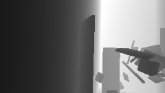

[](https://opensource.org/licenses/BSD-3-Clause) [](https://github.com/psf/black)

# [:arl-arl-logo: Aerial Gym Simulator](index.md)

Welcome to the documentation of the Aerial Gym Simulator &nbsp;&nbsp; [:fontawesome-brands-github:](https://www.github.com/ntnu-arl/aerial_gym_simulator)

The Aerial Gym Simulator is a high-fidelity physics-based simulator for training Micro Aerial Vehicle (MAV) platforms such as multirotors to learn to fly and navigate cluttered environments using learning-based methods. The environments are built upon the underlying [NVIDIA Isaac Gym](https://developer.nvidia.com/isaac-gym) simulator. We offer aerial robot models for standard planar quadrotor platforms, as well as fully-actuated platforms and multirotors with arbitrary configurations. These configurations are supported with low-level and high-level geometric controllers that reside on the GPU and provide parallelization for the simultaneous control of (hundreds of) thousands of multirotors.

This is the *second release* of the simulator and includes a variety of new features and improvements. Task definition and environment configuration allow for fine-grained customization of all the environment entities without having to deal with large monolithic environment files. Custom rendering framework allows obtaining depth, and segmentation images at high speeds and can be used to simulate custom sensors such as LiDARs with varying properties. The simulator is open-source and is released under the [BSD-3-Clause License](https://opensource.org/licenses/BSD-3-Clause).


Aerial Gym Simulator allows you to train state-based control policies in under a minute:


And train vision-based navigation policies in under an hour:


With GPU-accelerated and customizable ray-casting based LiDAR and Camera sensors with depth and segmentation capabilities. A customized environment twin allows embedding information into the envionment meshes that can be queried with these sensors:

 

 


## Features

- ??? note "**Modular and Extendable Design**"
      allowing users to easily create custom environments, robots, sensors, tasks, and controllers, and changing parameters programmatically on-the-go by modifying the [Simulation Components](./4_simulation_components.md)
- ??? note "**Rewritten from the Ground-Up**"
      to offer very high control over each of the simulation components and capability to extensively [customize](./5_customization.md) the simulator to your needs.
- ??? note "**High-Fidelity Physics Engine**"
      leveraging [NVIDIA Isaac Gym](https://developer.nvidia.com/isaac-gym/download), which provides a high-fidelity physics engine for simulating multirotor platforms, with the possibility of adding support for custom physics engine backends and rendering pipelines.
- ??? note "**Parallelized Geometric Controllers**"
      that reside on the GPU and provide parallelization for the [simultaneous control of (hundreds of) thousands of multirotor](./3_robots_and_controllers.md/#controllers) vehicles.
- ??? note "**Custom Rendering Framework**"
      (based on [NVIDIA Warp](https://nvidia.github.io/warp/)) used to design [custom sensors](./8_sensors_and_rendering.md/#warp-sensors) and perform parallelized kernel-based operations.
- ??? note "**Modular and Extendable**"
      allowing users to easily create [custom environments](./5_customization.md/#custom-environments), [robots](./5_customization.md/#custom-robots), [sensors](./5_customization.md/#custom-sensors), [tasks](./5_customization.md/#custom-tasks), and [controllers](./5_customization.md/#custom-controllers).
- ??? note "**Train RL-based control and navigation policies fast**"
      of your choice can be added for robot learning tasks. [Includes starter resources to facilitate implementation](./6_rl_training.md).


!!! warning "**Support for Isaac Lab**"
      Support for [Isaac Lab](https://isaac-sim.github.io/IsaacLab/) and [Isaac Sim](https://developer.nvidia.com/isaac/sim) is currently under development. We anticipate releasing this feature in the near future.


Please refer to the paper detailing the previous version of our simulator to get insights into the motivation and the design principles involved in creating the Aerial Gym Simulator: [https://arxiv.org/abs/2305.16510](https://arxiv.org/abs/2305.16510) (link will be updated to reflect the newer version soon!).

## Why Aerial Gym Simulator?

The Aerial Gym Simulator is designed to simulate hundreds of thousands of MAVs simultaneously and comes equipped with both low and high-level controllers that are used on real-world systems. In addition, the new customized ray-casting allows for superfast rendering of the environment for tasks using depth and segmentation from the environment.

The optimized code in this newer version allows training for motor-command policies for robot control in under and minute and vision-based navigation policies in under an hour. Extensive examples are provided to allow users to get started with training their own policies for their custom robots quickly.


## Citing
When referencing the Aerial Gym Simulator in your research, please cite the following paper

```bibtex
@misc{kulkarni2023aerialgymisaac,
      title={Aerial Gym -- Isaac Gym Simulator for Aerial Robots}, 
      author={Mihir Kulkarni and Theodor J. L. Forgaard and Kostas Alexis},
      year={2023},
      eprint={2305.16510},
      archivePrefix={arXiv},
      primaryClass={cs.RO},
      url={https://arxiv.org/abs/2305.16510}, 
}
```

If you use the reinforcement learning policy provided alongside this simulator for navigation tasks, please cite the following paper:

```bibtex
@misc{kulkarni2024reinforcementlearningcollisionfreeflight,
      title={Reinforcement Learning for Collision-free Flight Exploiting Deep Collision Encoding}, 
      author={Mihir Kulkarni and Kostas Alexis},
      year={2024},
      eprint={2402.03947},
      archivePrefix={arXiv},
      primaryClass={cs.RO},
      url={https://arxiv.org/abs/2402.03947}, 
}
```

## Quick Links
For you convenience, here are some quick links to the most important sections of the documentation:

- [Installation](./2_getting_started.md/#installation)
- [Robots and Controllers](./3_robots_and_controllers.md)
- [Sensors and Rendering Capabilities](./8_sensors_and_rendering.md)
- [RL Training](./6_rl_training.md)
- [Simulation Components](./4_simulation_components.md)
- [Customization](./5_customization.md)
- [FAQs and Troubleshooting](./7_FAQ_and_troubleshooting.md)


## Contact

Mihir Kulkarni  &nbsp;&nbsp;&nbsp; [Email](mailto:mihirk284@gmail.com) &nbsp; [GitHub](https://github.com/mihirk284) &nbsp; [LinkedIn](https://www.linkedin.com/in/mihir-kulkarni-6070b6135/) &nbsp; [X (formerly Twitter)](https://twitter.com/mihirk284)

Welf Rehberg &nbsp;&nbsp;&nbsp;&nbsp; [Email](mailto:welf.rehberg@ntnu.no) &nbsp; [GitHub](https://github.com/Zwoelf12) &nbsp; [LinkedIn](https://www.linkedin.com/in/welfrehberg/)

Theodor J. L. Forgaard &nbsp;&nbsp;&nbsp; [Email](mailto:tjforgaa@stud.ntnu.no) &nbsp; [GitHb](https://github.com/tforgaard) &nbsp; [LinkedIn](https://www.linkedin.com/in/theodor-johannes-line-forgaard-665b5311a/)

Kostas Alexis &nbsp;&nbsp;&nbsp;&nbsp; [Email](mailto:konstantinos.alexis@ntnu.no) &nbsp;  [GitHub](https://github.com/kostas-alexis) &nbsp; 
 [LinkedIn](https://www.linkedin.com/in/kostas-alexis-67713918/) &nbsp; [X (formerly Twitter)](https://twitter.com/arlteam)

This work is done at the [Autonomous Robots Lab](https://www.autonomousrobotslab.com), [Norwegian University of Science and Technology (NTNU)](https://www.ntnu.no). For more information, visit our [Website](https://www.autonomousrobotslab.com/).


## Acknowledgements
This material was supported by RESNAV (AFOSR Award No. FA8655-21-1-7033) and SPEAR (Horizon Europe Grant Agreement No. 101119774).

This repository utilizes some of the code and helper scripts from [https://github.com/leggedrobotics/legged_gym](https://github.com/leggedrobotics/legged_gym) and [IsaacGymEnvs](https://github.com/isaac-sim/IsaacGymEnvs).


## FAQs and Troubleshooting 

Please refer to our [website](https://ntnu-arl.github.io/aerial_gym_simulator/7_FAQ_and_troubleshooting/) or to the [Issues](https://github.com/ntnu-arl/aerial_gym_simulator/issues) section in the GitHub repository for more information.